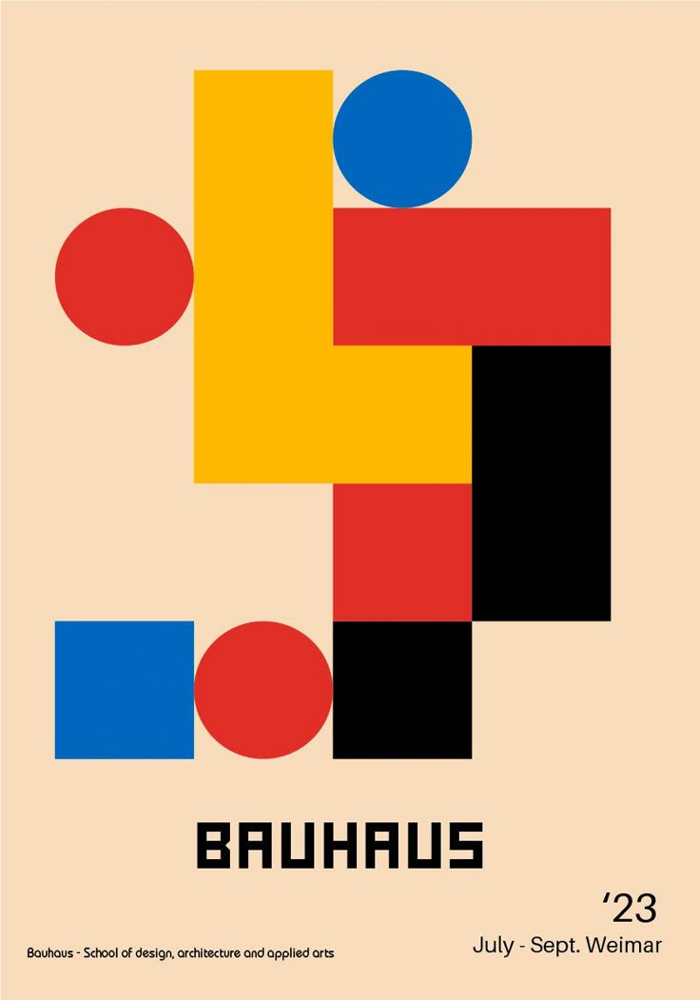

# pensamiento-computacional-solemne-2-
proceso de mi solemne 
link a mi proyecto:
[link](https://editor.p5js.org/claudia.castro3/sketches/VhYAXNIZ7)

# de que trata mi proyecto?

Mi proyecto es un sistema visual interactivo inspirado en el Op art y la bauhaus, use una combinación de estilos para lograr una visualidad interesante y llamativa. El proyecto esta desarrollado en p5.js donde utilizo figuras simples como los circulos y cuadrados que viene de la inspiracion de la bauhaus y estos los ordeno en una cuadricula repetitiva que da ese efecto optico del op art, a través de la interaccion con el mouse el sistema cambia en forma, color, tamaño y contraste dando la ilusion optica y movimiento del op art y los colores y formas (circulo, cuadrados y los colores rojo, amarillo, azul, negro y blanco) logran transmitir la bauhaus en esta combinacion de ambos estilos. 

## como funciona?

el sistema genera una cuadrícula de figuras repetidas utilizando el bucle anidado 
la interacción viene de el mouse, tanto del movimiento de este como del click:
1. al hacer click las figuras cambian de círculos a rectángulos
2. al mover el mouse de forma horizontal y vertical se cambia el tamaño de las figuras
3. la posición del mouse cambia los colores de las figuras y del canva:
- arriba a la izquierda es el color blanco 
- arriba a la derecha es el color rojo 
- abajo a la izquierda es el color azul
- abajo a la derecha es el color amarillo 
- y de forma horizontal cambia el fondo de blanco a negro

## que use para lograr mi proyecto:

**variables propias**
- size
- space
- mode
para controlar el tamaño, separación y cambios en las figuras

**condicionales**
 se utilizó varias if y else para:
- cambiar colores
- detectar posición del mouse 
- y alternan entre figuras

**funciones**
se utilizaron:
- setup()
- draw()
- mousePressed()
para organizar el funcionamiento del sistema

**bucles**
Se utilizaron bucles for y nested loops para repetir figuras en filas y columnas.

**input continuo**
el proyecto utiliza constantemente mouseX y mouseY 

**interactividad**
el usuario puede modificar 
- colores
- tamaño
- fondo
- figuras
mediante el movimiento y click del mouse

**Output visual dinámico y reactivo**
El sistema responde en tiempo real a las acciones del usuario, generando cambios visuales continuos y distintos resultados gráficos.

# inspiracion 
como explique en la descripcion de mi proyecto tomo inspiracion del Op art y la bauhaus, quise combinar ambos estilos para generar algo mas llamativo visualmente, ya que el Op art generalmente es blanco y negro para generar la ilusion optica y la bauhaus usa colores basicos de la paleta y formas basicas, al unir esto llegue a lo que eran estas formas de patron repetitivo que se van moviendo y generando una especia de ilusion, con colores y formas que lo hacen mas llamativo, colorido y dinamico. a continuacion dejo una pequeña galeria de mi inspiracion:

